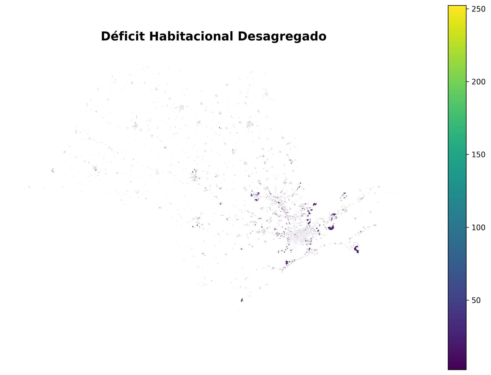
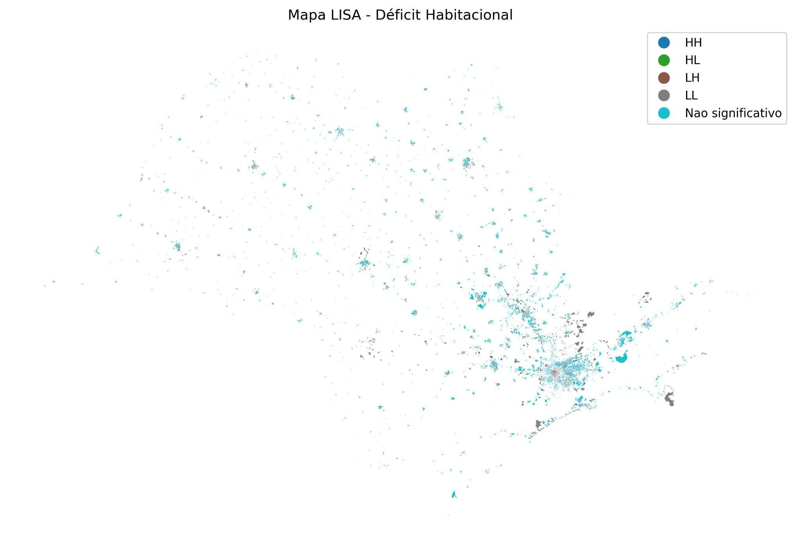

# IA Aplicada à Estimativa do Déficit Habitacional — Abordagem Multiescalar do Estado de São Paulo

Projeto de Iniciação Científica (PIBITI/PROPQ) desenvolvido na **Universidade Federal de São
Carlos (UFSCar)**, Programa de Pós-Graduação em Engenharia Urbana (PPGEU), vinculado ao grupo de
pesquisa **Cidades e Pessoas Conectadas**.

**Bolsista:** Griselda Karen Sillerico Justo
**Orientadora:** Profa. Dra. Elza Luli Miyasaka
**Co-orientadoras:** Dra. Tatiane Ferreira Olivatto · Me. Priscila Kauana Barelli Forcel
**Vigência:** out/2025 – out/2026

---

## Resumo do projeto

O déficit habitacional é tradicionalmente calculado pela metodologia da **Fundação João Pinheiro
(FJP)** em nível de **Área de Ponderação (AP)** — a menor unidade geográfica para a qual o
questionário da amostra do Censo Demográfico é representativo. Isso limita a identificação de
desigualdades habitacionais dentro das cidades, já que uma AP pode agrupar centenas de domicílios
com realidades muito diferentes entre si.

Este projeto usa **aprendizado de máquina** para desagregar essa estimativa para o nível de
**Setor Censitário (SC)** no estado de São Paulo. A
abordagem final combina:

1. Um modelo **Random Forest**, treinado nas Áreas de Ponderação, para aprender a relação entre
   variáveis do Censo (habitação, infraestrutura, composição familiar, renda) e o déficit
   habitacional total (FJP);
2. Uma etapa de **desagregação espacial baseada em escores de propensão**, que usa esse modelo
   para redistribuir — sem alterar — o valor já conhecido de cada AP entre seus setores
   censitários, de forma proporcional à propensão relativa de cada um;
3. Validação por **interpretabilidade** (SHAP, Permutation Importance) e por **autocorrelação
   espacial** (Índice de Moran Global, LISA), para checar se o resultado final é estatisticamente
   consistente e espacialmente plausível.

## Principais resultados

| Indicador | Resultado |
|---|---|
| R² médio (validação cruzada 5-fold, Random Forest, nível AP) | **0,9234** (± 0,0257) |
| MAE médio (validação cruzada 5-fold) | **104,25** (± 37,50) |
| Variável mais importante (SHAP / Permutation Importance) | `Soma_V015` — Outros parentes no domicílio |
| Auditoria da desagregação (soma dos setores vs. total da AP) | Diferença ≈ 10⁻¹³ (erro de ponto flutuante — consistência preservada) |
| Índice de Moran Global (autocorrelação espacial das estimativas) | **I = 0,5246** (p = 0,001) |
| Setores em clusters espaciais estatisticamente significativos (LISA) | **42,7%** (HH: 15,6% · LL: 22,9% · HL: 1,0% · LH: 3,4%) |

<p align="center">
  
  
</p>
<p align="center"><em>Esquerda: déficit habitacional estimado por setor censitário. Direita: clusters espaciais (LISA) — em azul, núcleos de alta concentração de déficit (HH).</em></p>

## Estrutura do repositório

```
.
├── README.md                      <- este arquivo
├── requirements.txt                <- dependências Python do projeto
├── .gitignore
│
├── data/
│   ├── raw/                        <- dados brutos (ver seção "Dados" abaixo)
│   │   ├── BD_SP_DEFICIT.xlsx               (Áreas de Ponderação — treino do modelo)
│   │   ├── BANCO_SP_setorcensitario.xlsx    (Setores Censitários — aplicação do modelo)
│   │   └── dicionario_variaveis.xlsx        (dicionário completo de variáveis)
│   └── processed/                  <- saídas intermediárias geradas pelos notebooks (vazio no repo)
│
├── notebooks/
│   ├── 01_area_ponderacao_xgboost.ipynb         <- Fase exploratória (XGBoost)
│   ├── 02_setor_censitario_desagregacao.ipynb   <- Fase final (Random Forest + desagregação espacial)
│   └── 03_conceitos_teoricos.ipynb              <- Notebook didático (não faz parte do pipeline)
│
├── docs/
│   ├── metodologia.md              <- resumo metodológico das duas fases
│   └── dicionario_variaveis.md     <- dicionário de variáveis em Markdown
│
├── references/
│   └── referencias.md              <- bibliografia consolidada do projeto
│
└── results/
    └── figures/                    <- principais gráficos e mapas gerados (imagens finais)
```

## Como reproduzir

### 1. Ambiente

```bash
python -m venv .venv
source .venv/bin/activate        # Windows: .venv\Scripts\activate
pip install -r requirements.txt
```

> `geopandas`, `libpysal`, `esda` e `splot` (usados apenas na análise espacial do notebook 02)
> têm dependências geoespaciais de sistema (GDAL/GEOS/PROJ). Se a instalação via `pip` falhar,
> recomenda-se usar `conda`/`mamba`:
> `conda install -c conda-forge geopandas libpysal esda splot`

### 2. Dados

Os arquivos em `data/raw/` já estão neste repositório, **exceto** a malha de setores censitários
do IBGE (shapefile), necessária apenas na parte final do notebook 02 (mapas e Moran/LISA), que
não foi incluída por seu tamanho. Baixe o shapefile do estado de São Paulo (Censo 2022) em:

<https://www.ibge.gov.br/geociencias/organizacao-do-territorio/malhas-territoriais/26565-malhas-de-setores-censitarios-divisoes-intramunicipais.html>

e salve como `data/raw/SP_setores_CD2022.zip` (ou ajuste o caminho na célula correspondente).

O notebook `01_area_ponderacao_xgboost.ipynb` usa os bancos brutos por subconjunto geográfico
(`BANCO_SPCAPITAL.xlsx`, `BANCO_SP_EXCETOCAPITAL.xlsx` e seus equivalentes por setor), que são
insumos intermediários anteriores à consolidação em `BD_SP_DEFICIT.xlsx` e **não estão incluídos**
neste repositório. Se você não os tiver, comece diretamente pelo notebook `02`, que já parte da
base consolidada.

### 3. Ordem de execução

1. `notebooks/03_conceitos_teoricos.ipynb` *(opcional, mas recomendado)* — explica as técnicas
   usadas antes de mexer nos dados reais.
2. `notebooks/01_area_ponderacao_xgboost.ipynb` *(opcional)* — documenta a fase exploratória e por
   que a abordagem mudou.
3. `notebooks/02_setor_censitario_desagregacao.ipynb` — pipeline final, do carregamento dos dados
   ao mapa final do déficit desagregado.

## Dados

| Arquivo | Nível geográfico | Linhas × Colunas | Descrição |
|---|---|---|---|
| `BD_SP_DEFICIT.xlsx` | Área de Ponderação | ~2.500 × 84 | Base de treino: 10 colunas de identificação geográfica + 68 variáveis explicativas (Censo, universo) + 5 componentes do déficit habitacional (FJP) + 1 identificador de AP |
| `BANCO_SP_setorcensitario.xlsx` | Setor Censitário | ~90.000 × 83 | Base de aplicação: mesmas variáveis explicativas do Censo (nomes de coluna por extenso, tratados no notebook 02), sem os componentes do déficit (que é o que estamos estimando) |
| `dicionario_variaveis.xlsx` | — | 83 variáveis | Descrição de cada coluna. Versão em Markdown: [`docs/dicionario_variaveis.md`](docs/dicionario_variaveis.md) |

Todas as variáveis explicativas derivam do **questionário do universo** do Censo Demográfico do
IBGE (2022); os componentes do déficit habitacional são calculados a partir do **questionário da
amostra**, segundo a metodologia da Fundação João Pinheiro, e só existem em nível de Área de
Ponderação — daí a necessidade da abordagem de desagregação descrita neste projeto.

## Metodologia (resumo)

Ver [`docs/metodologia.md`](docs/metodologia.md) para o detalhamento completo. Em síntese:

1. **Random Forest** treinado nas Áreas de Ponderação → prevê o déficit habitacional total a
   partir de 68 variáveis do Censo.
2. O mesmo modelo, aplicado aos Setores Censitários, gera **escores de propensão relativa**
   (não um valor de déficit).
3. Dentro de cada AP, os escores são normalizados e usados como **pesos** para redistribuir o
   valor total, já conhecido, da AP entre seus setores — preservando exatamente esse total.
4. A qualidade do modelo e da desagregação é validada por métricas de regressão, técnicas de
   interpretabilidade (SHAP, Permutation Importance) e autocorrelação espacial (Moran, LISA).

## Relatórios completos

Os relatórios completos do projeto (proposta de pesquisa, relatório parcial e relatório final,
com toda a revisão bibliográfica e discussão teórica) **não fazem parte deste repositório**. A
bibliografia consolidada está disponível em [`references/referencias.md`](references/referencias.md)
e o resumo metodológico em [`docs/metodologia.md`](docs/metodologia.md).

## Limitações e trabalhos futuros

- A desagregação por propensão depende da qualidade do modelo de Área de Ponderação; ela garante
  consistência agregada (a soma bate com o total conhecido), mas não garante que a distribuição
  *dentro* de cada AP seja perfeita — por isso a validação espacial (Moran/LISA) é parte
  essencial da metodologia, não apenas um extra.
- **Base censitária:** a proposta original previa o uso do Censo Demográfico 2022, mas os
  microdados da amostra desse Censo ainda não haviam sido divulgados pelo IBGE no início da
  pesquisa (ver nota de rodapé da proposta). Por isso, a modelagem final (Random Forest +
  desagregação por propensão, notebook 02) foi desenvolvida com o **Censo Demográfico de 2010**,
  enquanto o teste exploratório com XGBoost (notebook 01) já incorporava dados mais recentes
  conforme iam sendo liberados. Uma atualização natural do projeto é reexecutar o pipeline final
  com os microdados do Censo 2022 assim que integralmente disponíveis.
- Próximos passos sugeridos: (i) testar outras técnicas de desagregação espacial (ex.: modelos
  baseados em regressão geograficamente ponderada); (ii) incorporar dados de registros
  administrativos (ex.: CadÚnico) como fontes auxiliares; (iii) validar as estimativas de setor
  censitário contra alguma fonte de referência independente, quando disponível.

## Tecnologias

Python · pandas · scikit-learn · XGBoost · SHAP · GeoPandas · libpysal · esda · splot ·
matplotlib · seaborn

## Licença

Defina aqui a licença de sua preferência para o código deste repositório (ex.: MIT, CC-BY-4.0).
Os dados do Censo Demográfico são de domínio público, disponibilizados pelo IBGE.

## Citação

Se este trabalho for útil para sua pesquisa, por favor cite:

```
SILLERICO JUSTO, G. K. Inteligência Artificial Aplicada à Estimativa do Déficit Habitacional:
uma abordagem multiescalar do Estado de São Paulo. Relatório Final de Iniciação Científica
(PIBITI/PROPQ). Orientação: Elza Luli Miyasaka. São Carlos: UFSCar, 2026.
```

## Agradecimentos

Ao grupo de pesquisa **Cidades e Pessoas Conectadas** (UFSCar/PPGEU), pela orientação teórica e
metodológica ao longo do projeto, e ao Programa Institucional de Bolsas de Iniciação em
Desenvolvimento Tecnológico e Inovação (PIBITI/PROPQ-UFSCar).
